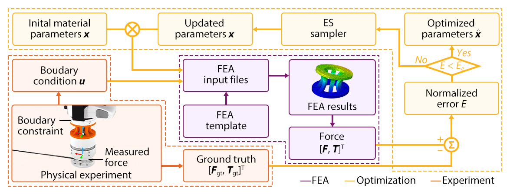
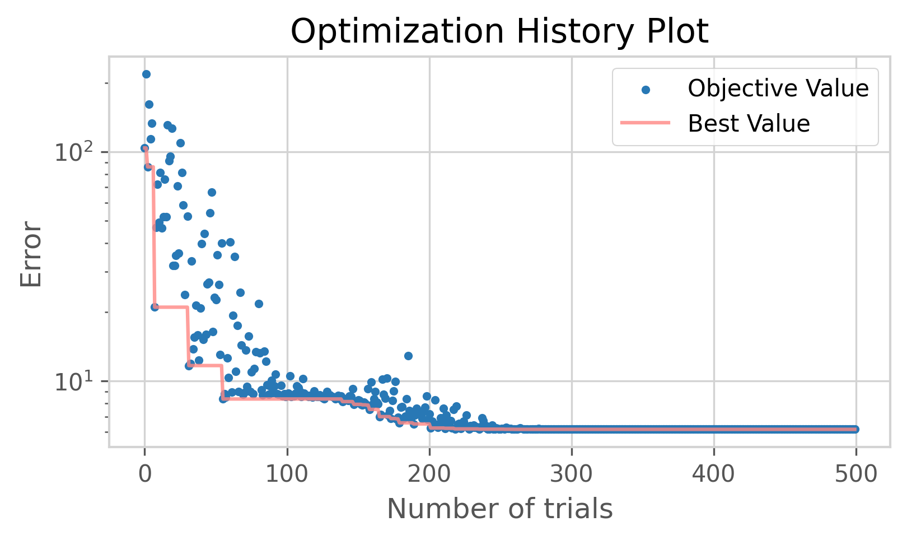
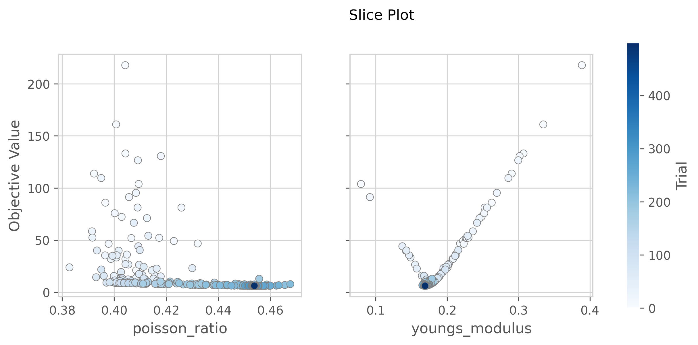
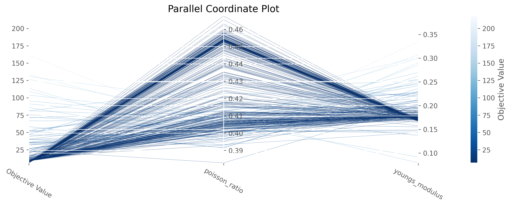
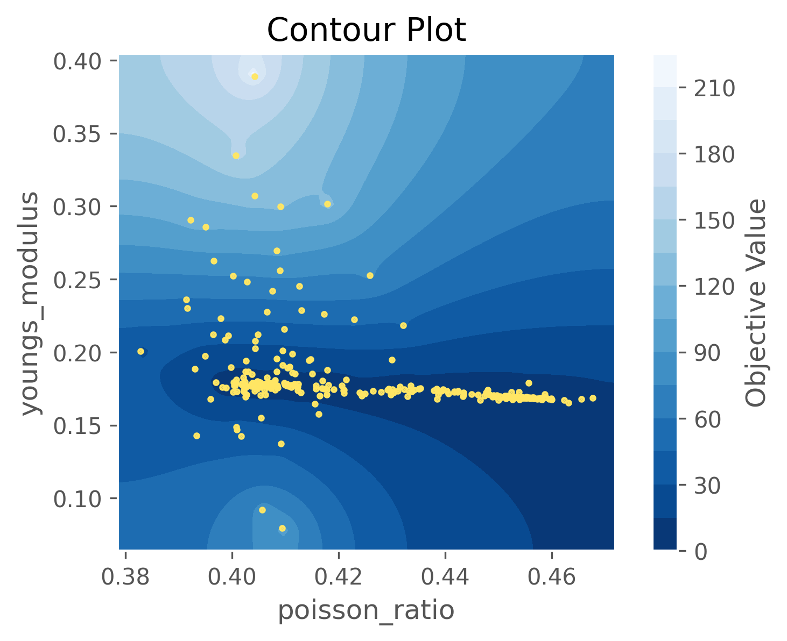

# EVOMIA: Evolutionary Optimization for Material Identification with Abaqus

[](https://www.python.org) [](https://www.3ds.com/products-services/simulia/products/abaqus/) [](https://github.com/optuna/optuna) [](https://github.com/han-xudong/EVOMIA.git)

## Overview

**Evolutionary Optimization for Material Identification with Abaqus (EVOMIA)** is a framework for material parameter identification based on experimental data using evolutionary optimization algorithm and Abaqus. The goal is to minimize the error between the finite element analysis (FEA) and the real data measured from experiments for a certian object, especially with complex geometric shapes and material properties. The framework is designed to be flexible and easy to use, and it can be applied to various objects and materials.

Here is a brief view of the framework, taking force measurement and displacement boundary conditions as an example:

<div align="center"></div>

The framework consists of three main components:

- **Evolutionary Optimization Algorithm**: Optimizing the material parameters using the covariance matrix adaptation evolution strategy (CMA-ES), in order to minimize the error between the simulation and real data.
- **Abaqus**: Simulating the behavior of certian objects with given material parameters and boundary conditions.
- **Experimental Data**: Collecting the experimental data as the ground truth for the optimization.

After the optimization process, we can get the optimized material parameters of the object, and generate FEA results that are better matched with the real data. The results can be used for further applications, such as learning model training, structural design, etc.

## Installation

EVOMIA needs to be installed first before use. The code requires `python>=3.7` and `abaqus>=2022`.

Note that it's recommended to create a new Python environment for this installation to avoid conflicts with other packages. For example, you can use `conda` to create a new environment:

```bash
conda create -n evomia python=3.10
conda activate evomia
```

Then you can install EVOMIA using:

```bash
git clone https://github.com/ancorasir/EVOMIA.git
cd EVOMIA
pip install pip -U
pip install -r requirements.txt
```

## Quick Start

Here are several files needed to prepare before running the code:

- `{obj_name}_{material}.inp`: The input file generated by Abaqus CAE, which contains the simulation settings, such as boundary conditions, material properties, and mesh information. You need to replace the material parameters with replacable parameters, such as `youngs_modulus`, `poisson_ratio`, etc, as well as the boundary conditions.
- `{material}.json`: The material file that contains the material model parameters which are to be optimized. Each parameter should be defined by given a range of values, such as `youngs_modulus: [0.05, 05]`.
- `{output}.json`: The output file contains the output parameters that are used to calculate the error, corresponding to the output data.

These files are stored in the `templates` folder. And you also need to collect the experimental data and store it as `{obj_name}_{material}_{output}.json` file in the `data/ground_truth` folder. The data format can refer to the example files in the folder.

If you don't have above files, you can use the example files to run the code directly. The example settings are `obj_name=cylinder`, `material=linear`, `output=integrated_force`. You can run the code using:

```bash
python evomia.py
```

During the process, the parameters and error will be shown in the console, as well as the trial number for the best parameters. All data will be saved in `databoard.sqlite3`, and you can visualize the data by right-clicking on the file and selecting `Open with Optuna Dashboard`, or just follow the [tutorial](notebooks/tutorial.ipynb) to see the results.

<div align="center">
<table><tr>
<td></td>
<td></td>
</tr></table>

<table><tr>
<td></td>
<td></td>
</tr></table>
</div>

Please refer to the [tutorial](notebooks/tutorial.ipynb) for more details.

## Contributing

Contributions are welcome! For bug reports or requests, please submit an issue. For code contributions, please submit a pull request.

## License

EVOMIA is licensed under the [MIT License](LICENSE).

## Acknowledgements

- **[cmaes](https://github.com/CyberAgentAILab/cmaes)**: A simple and practical Python library for the Covariance Matrix Adaptation Evolution Strategy (CMA-ES).
- **[Optuna](https://github.com/optuna/optuna)**: A hyperparameter optimization framework that supports CMA-ES using this library under the hood.
- **[Abaqus](https://www.3ds.com/products-services/simulia/products/abaqus/)**: A software suite for finite element analysis with Python script support.
